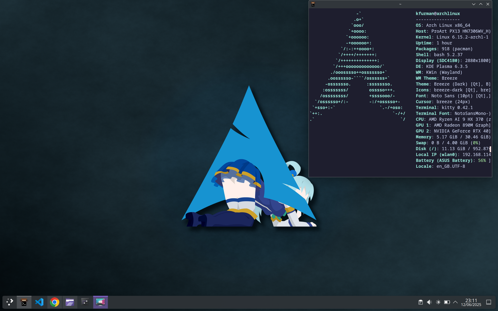

# Arch (and CachyOS)


## Updating system packages

```bash
sudo pacman -Syu --noconfirm
```

## Install yay

```bash
cd /opt
sudo git clone https://aur.archlinux.org/yay.git
sudo chown -R kfurman:kfurman yay
cd yay
makepkg -si --noconfirm
```

## Install essential packages

```bash
sudo pacman -S --noconfirm kitty gparted git neovim python-pip gcc cmake make tmux \
  zeromq npm raylib alsa-lib systemd go nodejs fastfetch gimp xournalpp
```

Get kitty theme from https://github.com/catppuccin/kitty/blob/main/themes/mocha.conf

## Set wifi region correctly - if speed locked at 2.4GHz

```bash
pacman -Sy --needed --noconfirm iw wireless-regdb
echo 'WIRELESS_REGDOM="GB"' >/etc/conf.d/wireless-regdom
mkinitcpio -P
iw reg set GB
```

## Install AUR packages with yay

```bash
yay -S --noconfirm google-chrome visual-studio-code-bin discord steam \
  github-cli zmqpp cursor-bin
```

on ASUS laptops also:

```bash
yay -S --noconfirm asusctl supergfxctl
```

## Setting up default editor

```bash
sudo nvim /etc/profile
```
add: `export EDITOR=/usr/bin/nvim`

## Sett up fastfetch in .bashrc

```bash
sudo nvim "/home/kfurman/.bashrc"
```
add: `fastfetch`

## Install Rust

```bash
curl --proto '=https' --tlsv1.2 -sSf https://sh.rustup.rs | sh -s -- -y
```

## Clone LazyVim

```bash
sudo git clone https://github.com/LazyVim/starter "/home/kfurman/.config/nvim"
sudo rm -rf "/home/kfurman/.config/nvim/.git"
```

## Set up Catppuccin GRUB theme

```bash
git clone https://github.com/catppuccin/grub.git /tmp/grub
sudo mkdir -p /usr/share/grub/themes
sudo cp -r /tmp/grub/src/catppuccin-mocha-grub-theme /usr/share/grub/themes/
sudo sed -i 's|^#GRUB_TERMINAL_OUTPUT=.*|# GRUB_TERMINAL_OUTPUT="console"|' /etc/default/grub
sudo nvim /etc/default/grub
```

add: `GRUB_THEME="/usr/share/grub/themes/catppuccin-mocha-grub-theme/theme.txt"`

and put into effect:
```bash
sudo grub-mkconfig -o /boot/grub/grub.cfg
```

## Install Docker

```bash
sudo pacman -S --noconfirm docker
sudo systemctl enable docker.service
sudo systemctl start docker.service
sudo usermod -aG docker kfurman
```

## Setting up NVIDIA drivers - not needed on CachyOS

```bash
sudo pacman -S --noconfirm nvidia nvidia-utils nvidia-settings nvidia-prime
sudo nvim /etc/mkinitcpio.conf
```

add: `MODULES=(nvidia nvidia_modeset nvidia_uvm nvidia_drm)`

```bash
sudo mkinitcpio -P
sudo bootctl update
sudo grub-mkconfig -o /boot/grub/grub.cfg
sudo systemctl enable nvidia-hibernate.service nvidia-suspend.service nvidia-resume.service nvidia-powerd.service
```

## Setting up ASUS drivers

```bash
sudo systemctl enable supergfxd.service
```

## Screenshot

