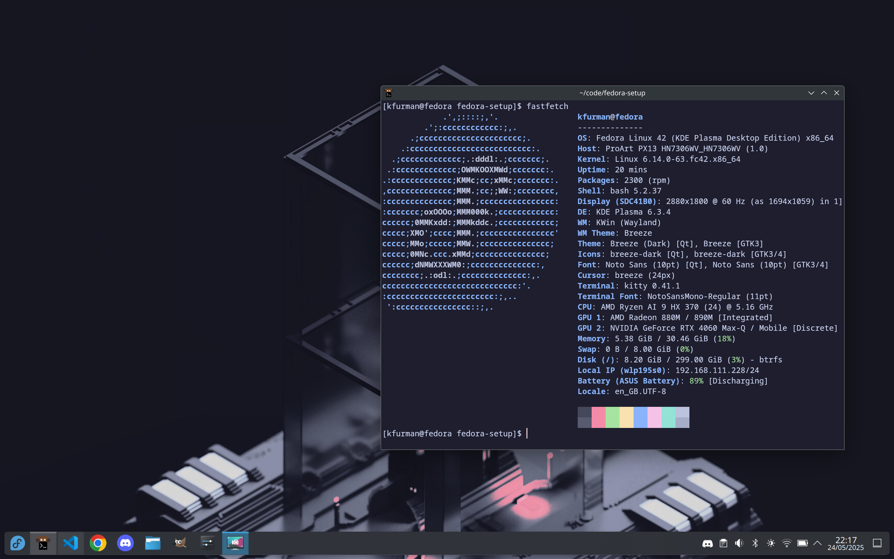

# Fedora (and Nobara)

## set keyboard backlight to max brightness

```bash
cat /sys/class/leds/asus::kbd_backlight/max_brightness
```

will say number like 3

```bash
sudo sh -c "echo 3 > /sys/class/leds/asus::kbd_backlight/brightness"
```

## update dnf

```bash
sudo dnf check-update
```

## kitty terminal

```baash
sudo dnf install kitty -y
```

get the catpuccin theme from https://github.com/catppuccin/kitty and set as default terminal in system settings

## gparted

```bash
sudo dnf install gparted -y
```

## firefox

get .rpm from their website

## git

```bash
sudo dnf install git -y
sudo dnf install gh -y
gh auth login #log into to github
```

## neovim

```bash
sudo dnf install neovim -y
sudo nvim /etc/profile
```

add: `export EDITOR=/usr/bin/nvim at the end of the file`

## vs-code

```bash
sudo rpm --import https://packages.microsoft.com/keys/microsoft.asc
echo -e "[code]\nname=Visual Studio Code\nbaseurl=https://packages.microsoft.com/yumrepos/vscode\nenabled=1\nautorefresh=1\ntype=rpm-md\ngpgcheck=1\ngpgkey=https://packages.microsoft.com/keys/microsoft.asc" | sudo tee /etc/yum.repos.d/vscode.repo >/dev/null
sudo dnf install code -y
```

## pip

```bash
sudo dnf install python3-pip -y
```

## rust

```bash
sudo dnf install curl gcc make -y
sudo dnf install systemd-devel -y
sudo dnf install alsa-lib-devel -y
curl --proto '=https' --tlsv1.2 -sSf https://sh.rustup.rs | sh
```

## C++

```bash
sudo dnf install -y gcc-c++ cmake make tmux zeromq zeromq-devel raylib -y
```

## GO

```bash
sudo dnf install golang -y
nvim ~/.bashrc
```

add: `export PATH="$PATH:~/go/bin"`

## node-js - usally already installed tho

```bash
sudo dnf install nodejs -y
```

## grub theme

```bash
git clone https://github.com/catppuccin/grub.git
cd grub
sudo mkdir -p /usr/share/grub/themes
sudo cp -r src/catppuccin-mocha-grub-theme /usr/share/grub/themes/
sudo nvim /etc/default/grub
```

add: `GRUB_THEME="/usr/share/grub/themes/catppuccin-mocha-grub-theme/theme.txt"`
comment line: # GRUB_TERMINAL_OUTPUT="console"

```bash
sudo grub2-mkconfig -o /boot/grub2/grub.cfg
```

## Nerd Fonts

```bash
mkdir -p ~/.local/share/fonts
cd ~/.local/share/fonts
wget https://github.com/ryanoasis/nerd-fonts/releases/latest/download/JetBrainsMono.zip
unzip JetBrainsMono.zip
fc-cache -fv
sudo nvim ~/.config/kitty/kitty.conf # or ctrl+shift+F2
```

add: `font_family JetBrainsMono Nerd Font`

## LazyVim

```bash
git clone https://github.com/LazyVim/starter ~/.config/nvim
rm -rf ~/.config/nvim/.git
nvim
```

## fastfetch, for cute screenshots -preinstalled on Nobara

```bash
sudo dnf install fastfetch -y
sudo nvim ~/.bashrc
```

add: `fastfetch at the end to make it run on new shell for vanity`

## discord

```bash
sudo dnf install https://download1.rpmfusion.org/nonfree/fedora/rpmfusion-nonfree-release-$(rpm -E %fedora).noarch.rpm -y
sudo dnf install discord -y
```

## steam -preinstalled on Nobara

```bash
sudo dnf install steam -y #also requires the rpmfusion repo like discord does
```

## GIMP

```bash
sudo dnf install gimp -y
```

## Xournal++

```bash
sudo dnf install xournalpp -y
```

## snapper - for making snapshots of your root directory - optional, needs btrfs filesystem

```bash
sudo dnf install snapper -y
sudo dnf install python3-dnf-plugin-snapper
sudo snapper -c root create-config /
sudo snapper create --description "Initial setup."
```

## Nvidia drivers - RISKY! - Not needed on Nobara!

```bash
sudo dnf install https://mirrors.rpmfusion.org/free/fedora/rpmfusion-free-release-$(rpm -E %fedora).noarch.rpm https://mirrors.rpmfusion.org/nonfree/fedora/rpmfusion-nonfree-release-$(rpm -E %fedora).noarch.rpm -y
sudo dnf update -y
sudo dnf install kernel-devel -y
sudo dnf install akmod-nvidia xorg-x11-drv-nvidia-cuda -y
sleep 5m # need to wait for processes in the background to finish
sudo systemctl enable nvidia-hibernate.service nvidia-suspend.service nvidia-resume.service nvidia-powerd.service
sudo reboot
```

## asus drivers for laptops - not needed on Nobara!

```bash
sudo dnf copr enable lukenukem/asus-linux -y
sudo dnf update
sudo dnf install asusctl supergfxctl -y
sudo dnf update --refresh
sudo systemctl enable supergfxd.service
sudo dnf install asusctl-rog-gui -y
```

## screenshot

