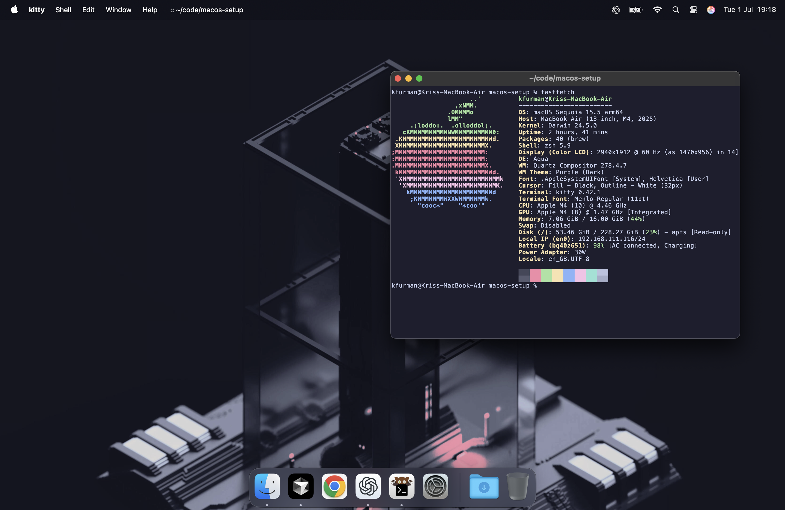

# MacOS

## Specific system improvements

Make the `Dock` hide and show instantenously (underrated day to day efficiency increase):

```bash
defaults write com.apple.dock autohide-delay -float 0
defaults write com.apple.dock autohide-time-modifier -float 0
killall Dock
```

Also to show hidden files in `Finder` by default run:

```bash
defaults write com.apple.finder AppleShowAllFiles -bool true
killall Finder
```

## Firefox

[Download here](https://www.firefox.com/en-GB/) -> or pick another browser you use to keep accounts in sync between devices

## Kitty terminal

```bash
curl -L https://sw.kovidgoyal.net/kitty/installer.sh | sh /dev/stdin
```

Then get the theme from [here](https://github.com/catppuccin/kitty/blob/main/themes/mocha.conf) and paste it at the end of the config file (`cmd+,`)

## Homebrew

```bash
/bin/bash -c "$(curl -fsSL https://raw.githubusercontent.com/Homebrew/install/HEAD/install.sh)"
#then follow the instructions to add to path or do:
echo 'eval "$(/opt/homebrew/bin/brew shellenv)"' >>~/.zprofile
eval "$(/opt/homebrew/bin/brew shellenv)"
```

## Github CLI

```bash
brew install gh
gh auth login
```

## VS Code

Download from [here](https://code.visualstudio.com/download) and use Github account for syncing.

## Rust

```bash
curl --proto '=https' --tlsv1.2 -sSf https://sh.rustup.rs | sh
```

## C++

```bash
brew install gcc cmake pkg-config sdl2 raylib
```

## Go

```bash
brew install go
#add go to path
vim ~/.zshenv
export PATH="$HOME/go/bin:$PATH"
```

## NPM

```bash
brew install npm
```

## Python

```bash
brew install python3
#create python venv with latest version
python3 -m venv ~/pyenv
#activate with: source ~/pyenv/bin/activate
```

## Docker

```bash
brew install docker colima qemu lima lima-additional-guestagents
#colima start --arch x86_64 --vm-type qemu --memory 4 --cpu 2 --verbose
#docker run --rm -it ubuntu:24.04 bash
```

## Fastfetch

```bash
# install fastfetch because it's cool
brew install fastfetch
```

## Neovim

```bash
# install neovim
brew install neovim
#and lazyvim
git clone https://github.com/LazyVim/starter ~/.config/nvim
rm -rf ~/.config/nvim/.git
nvim
```

## Tmux

```bash
brew install tmux
```

## other CLI tools

```bash
brew install bat exa fd ripgrep fzf tree htop jq
```

## Fonts - useful for neovim compatibility

```bash
# fonts
brew tap homebrew/cask-fonts
brew install --cask font-fira-code font-jetbrains-mono
```

## Screenshot

